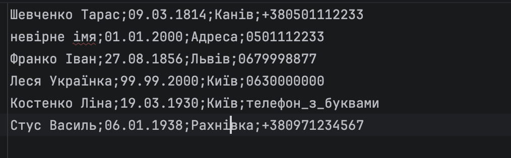

<b>Лабораторна робота №11</b>

<b>Тема: Регулярні вирази. Перевірка даних</b>

## Мета
Ознайомлення з принципами використання регулярних виразів (Regex) для валідації даних.

## 1 ВИМОГИ
1. Розробити регулярні вирази для перевірки полів domain-об'єкта (`AddressEntry`):
    - ПІБ (Кирилиця, з великої літери).
    - Дата (формат DD.MM.YYYY).
    - Телефон (формат України).
2. Забезпечити валідацію:
    - При введенні з клавіатури (не пропускати далі, поки дані не вірні).
    - При читанні з файлу (пропускати некоректні рядки з виводом помилки).

---

## 2 ОПИС ПРОГРАМИ

### 2.1 Клас RegexValidator
Містить скомпільовані шаблони перевірки.
- **Ім'я:** `^[A-ZА-ЯІЇЄ][a-zа-яіїє']+(\s[A-ZА-ЯІЇЄ][a-zа-яіїє']+)+$`
- **Телефон:** `^(\+38)?0\d{9}$` (підтримує формати +380991234567 та 0991234567).
- **Дата:** `^(0[1-9]|[12][0-9]|3[01])\.(0[1-9]|1[0-2])\.\d{4}$` (перевіряє коректність днів та місяців).

### 2.2 Режими роботи
1. **Інтерактивний:** Використовує цикл `while`, який блокує просування користувача, доки введені дані не пройдуть перевірку методом `RegexValidator.isValid...()`.
2. **Автоматичний (-auto):** Програма зчитує файл `import_data.txt`, розбиває рядки за роздільником `;` та перевіряє кожне поле. Невалідні рядки ігноруються з виведенням повідомлення про помилку в консоль.

---

## 3 ВАРІАНТИ ВИКОРИСТАННЯ

### 3.1 Імпорт з файлу (-auto)
У файлі `import_data.txt` містяться як коректні, так і помилкові дані. Програма успішно відфільтрувала помилки.

**Результат роботи:**

### 3.2 Валідація при введенні
При спробі ввести некоректну дату або телефон програма видає помилку і просить повторити введення.

**Результат роботи:**

---

## ВИСНОВКИ
У ході виконання роботи було інтегровано механізм валідації даних за допомогою регулярних виразів `java.util.regex`. Це дозволило забезпечити цілісність даних у контейнері, відфільтровуючи некоректні значення на етапі введення.