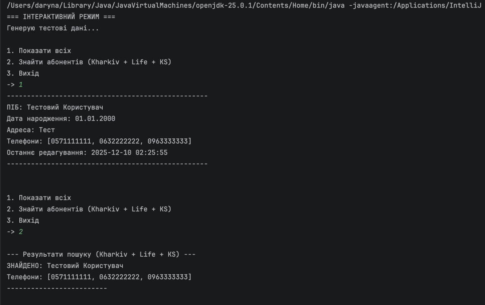

<b>Лабораторна робота №12</b>

<b>Тема: Регулярні вирази. Обробка тексту</b>

## Мета
Демонстрація ефективного використання регулярних виразів для пошуку даних за складними критеріями.

## 1 ВИМОГИ
1. Реалізувати пошук контактів в адресній книзі за умовою Варіанта 3:
    - Наявність Харківського міського номера (код 057).
    - Наявність номера Lifecell (коди 063, 093, 073).
    - Наявність номера Kyivstar (коди 067, 068, 096, 097, 098).
2. Запис повинен містити **всі три типи** номерів одночасно.

---

## 2 ОПИС ПРОГРАМИ

### 2.1 Регулярні вирази
Використано клас `java.util.regex.Pattern` для компіляції шаблонів.
- Харків: `^(\+38)?057\d{7}$`
- Lifecell: `^(\+38)?0(63|93|73)\d{7}$` — використовується групування `(...)` та оператор АБО `|` для переліку кодів.
- Kyivstar: `^(\+38)?0(67|68|96|97|98)\d{7}$`

### 2.2 Алгоритм пошуку
Клас `PhoneSearcher` проходить по кожному контакту. Для кожного контакту перевіряється весь список його телефонів (`ArrayList`).
Використовуються три прапорці (`boolean`): `hasKharkiv`, `hasLife`, `hasKyivstar`.
Якщо після перевірки всіх номерів всі три прапорці дорівнюють `true`, контакт вважається знайденим.

---

## 3 ВАРІАНТИ ВИКОРИСТАННЯ

### 3.1 Автоматичний режим (-auto)
Програма створює три контакти:
1. Має тільки Life.
2. Має Life та Kyivstar.
3. Має Life, Kyivstar та Харківський номер.

Пошук успішно ігнорує перші два записи і знаходить лише третій.

**Результат пошуку:**

---

## ВИСНОВКИ
У ході виконання роботи було використано можливості регулярних виразів для аналізу текстових даних (номерів телефонів). Реалізовано складний фільтр пошуку, що базується на комбінації декількох regex-патернів.