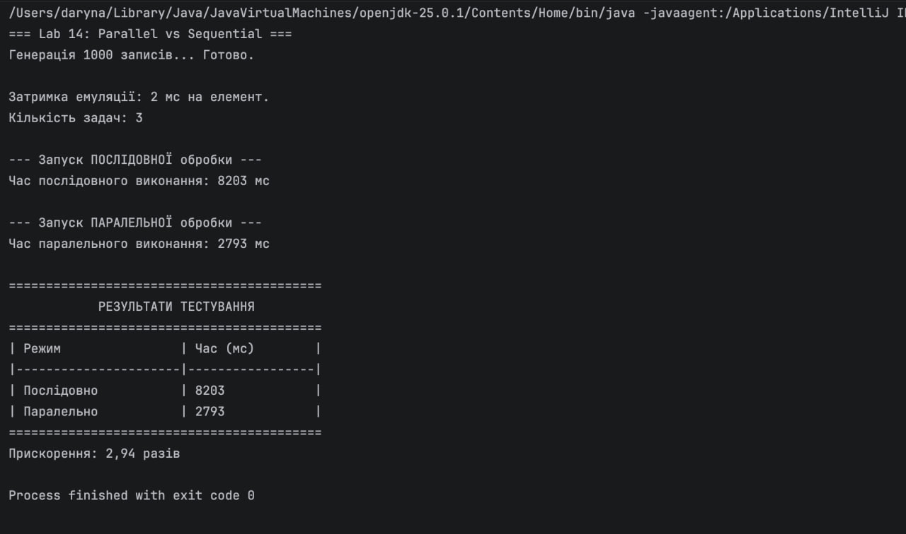

<b>Лабораторна робота №14</b>

<b>Тема: Multithreading. Ефективність використання</b>

## Мета
Вимірювання часу та демонстрація ефективності паралельної обробки даних порівняно з послідовною.

## 1 ВИМОГИ
1. Реалізувати алгоритми обробки контейнера зі штучною затримкою (`Thread.sleep`) для емуляції "важких" обчислень.
2. Виміряти час виконання трьох задач у **послідовному** режимі (одна за одною).
3. Виміряти час виконання тих самих задач у **паралельному** режимі (одночасно в окремих потоках).
4. Розрахувати коефіцієнт прискорення.

---

## 2 ОПИС ПРОГРАМИ

### 2.1 Методика вимірювання
Використовується метод `System.currentTimeMillis()` для фіксації часу початку та завершення блоку коду.
- **Послідовно:** Методи `task1()`, `task2()`, `task3()` викликаються в головному потоці. Час виконання — це сума часу всіх задач.
- **Паралельно:** Створюються три об'єкти `Thread`. Час виконання визначається найповільнішим потоком (оскільки вони стартують одночасно).

### 2.2 Параметри тестування
- Кількість записів: 1000.
- Затримка на 1 запис: 2 мс.
- Теоретичний час однієї задачі: ~2000 мс (2 сек).
- Теоретичний час послідовно (3 задачі): ~6000 мс.
- Теоретичний час паралельно: ~2000 мс (плюс накладні витрати на створення потоків).

---

## 3 РЕЗУЛЬТАТИ

Програма виконала тести та вивела зведену таблицю.

**Скріншот результатів:**

### Аналіз результатів
Як видно з таблиці, паралельне виконання зайняло значно менше часу.
Коефіцієнт прискорення наближається до **3.0** (кількість потоків), що свідчить про високу ефективність розпаралелювання незалежних задач.
Незначне відхилення від ідеального показника (3.0) пояснюється накладними витратами операційної системи на створення та перемикання контексту потоків.

---

## ВИСНОВКИ
У ході лабораторної роботи було експериментально підтверджено ефективність використання багатопоточності для виконання ресурсоємних незалежних задач.
Паралельна обробка дозволила скоротити час виконання програми майже втричі порівняно з послідовним підходом.